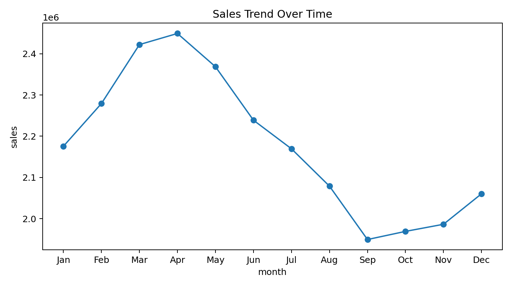
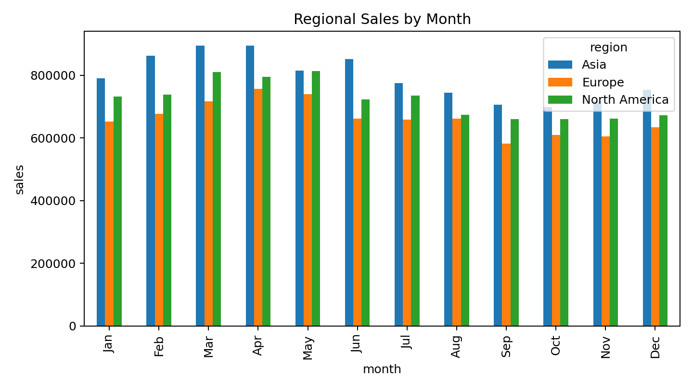
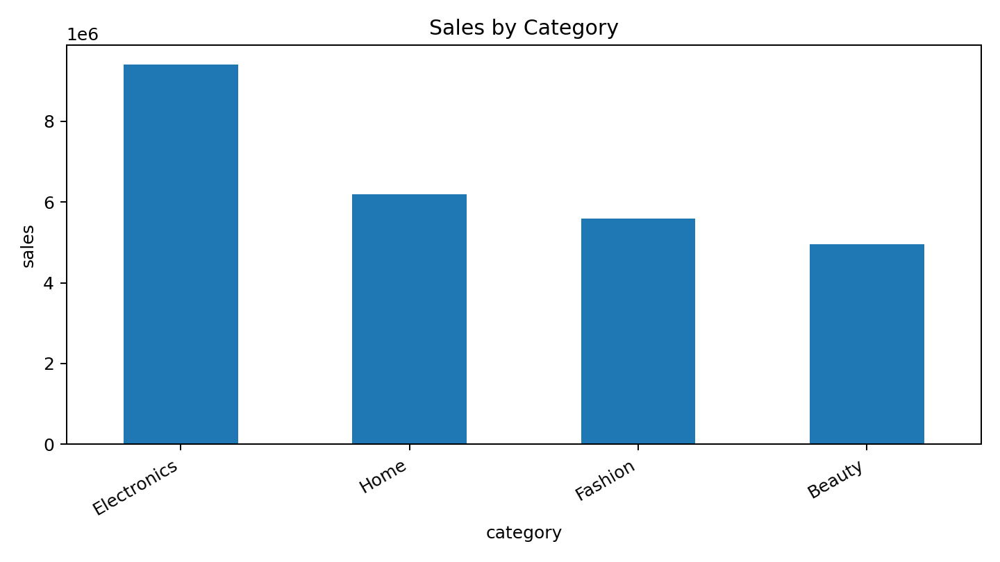
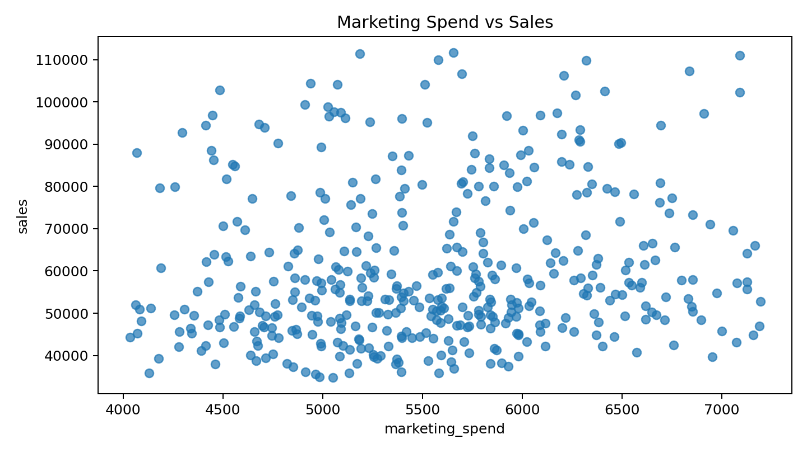

# Presentation Agent Deck

## 1. Presentation Goal

**Purpose:** Set the context for the deck.

- Goal: Explain annual e-commerce performance
- Audience: senior business managers
- Dataset size: 432 rows and 7 columns

## 2. Overall Sales Trend

**Purpose:** Summarize the business trajectory over time.

- Overall sales changed by -5.3% from the first visible month to the last visible month.
- The dataset contains 3 numeric metrics that can support performance analysis.

## 3. Regional Performance

**Purpose:** Compare the strongest markets.

- Top region by revenue: Asia
- Regional comparison helps identify where future investment may have the largest impact.

## 4. Category Mix

**Purpose:** Explain which categories drive the business.

- Top category by revenue: Electronics
- Category concentration can guide inventory and campaign planning.

## 5. Marketing Effectiveness

**Purpose:** Evaluate the relationship between spending and results.

- Scatter analysis helps reveal whether higher spend aligns with higher sales.
- A stronger upward pattern suggests marketing is contributing to revenue growth.

## 6. Key Takeaways

**Purpose:** End with concise recommendations.

- Protect momentum in Asia while improving weaker regions.
- Double down on Electronics while testing cross-sell opportunities.
- Use chart-backed findings to decide next-quarter allocation.

