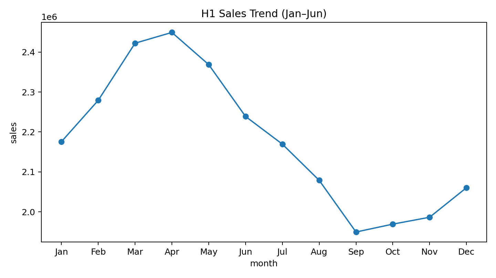
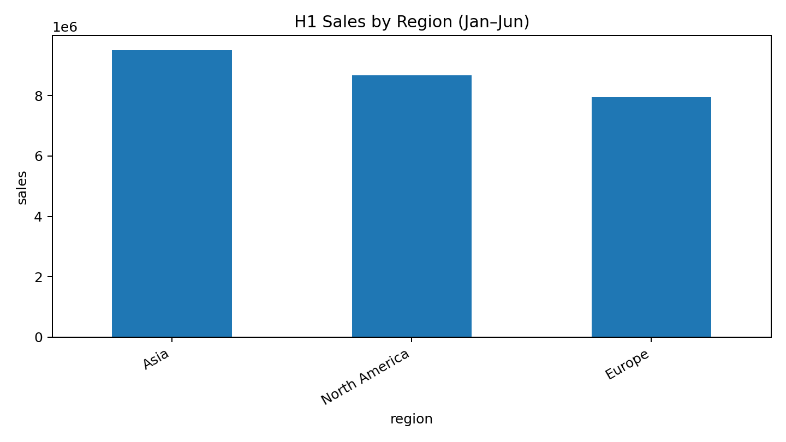
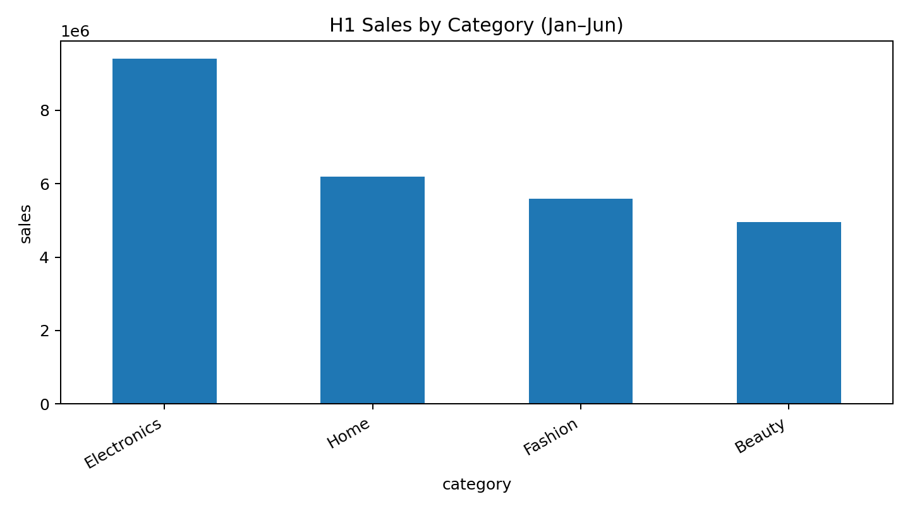
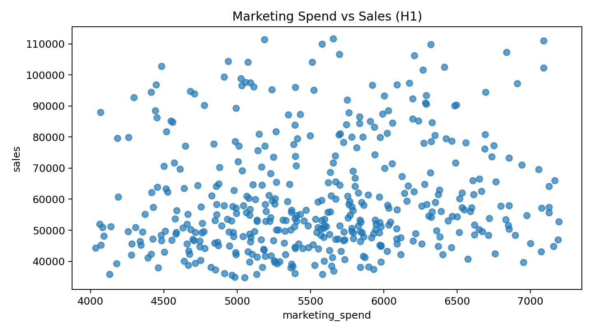

# Presentation Agent Deck

## 1. H1 performance at a glance

**Purpose:** Set the executive context on first-half momentum and where to focus next.

- Summarize Jan–Jun sales trajectory and any inflection points
- Call out best vs weakest months to frame seasonality and pacing
- Preview key driver cuts: region, category, and marketing efficiency

## 2. Where growth came from: regions

**Purpose:** Identify which regions drove H1 results and where intervention is needed.

- Rank regions by total H1 sales contribution
- Highlight concentration risk if one region dominates
- Recommend actions: double down in top region(s) and diagnose underperformers (channel, assortment, promo)

## 3. What’s selling: category mix

**Purpose:** Pinpoint category winners/laggards to guide merchandising and inventory decisions.

- Compare H1 sales across categories to spot leaders and drags
- Use results to prioritize inventory, pricing, and onsite placement
- Flag categories needing turnaround plans (promo strategy, bundling, content, availability)

## 4. Is marketing spend paying off?

**Purpose:** Assess spend-to-sales relationship and identify budget reallocation opportunities.

- Check whether higher marketing_spend correlates with higher sales in H1
- Compare efficiency patterns by region to find over/under-invested areas
- Action: shift budget toward regions showing stronger sales response; test/trim where response is weak

## 5. H2 priorities & decisions

**Purpose:** Convert H1 insights into a focused action plan and asks for leadership.

- Rebalance budgets by regional efficiency; set guardrails and weekly KPIs (sales, units, marketing_spend)
- Prioritize top categories for supply and placement; launch fixes for laggards
- Align on 2–3 near-term experiments (promo, pricing, assortment) and owners/timelines

